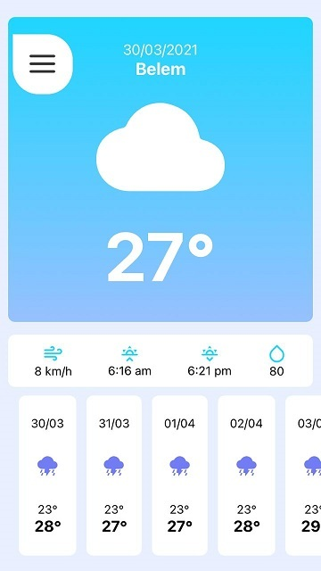

# API 
<h3>https://console.hgbrasil.com/keys</h3>

# Projeto Tempo
> Esse projeto foi um estudo React Native + consumo de api e front-end. 

#### APP TEMPO RECURSOS
> Pega a geolocalização do celular para mostrar dados sobre o tempo na região onde ele se encontra  
> Uma area para a pesquisar o clima por cidade. 

## Imagens do projeto

## Como usar:
1. Abra o projeto
2. Use: "yarn" para baixar o node_modules
3. Depois use: "expo start" para iniciar o projeto

## Conteudo desse estudo
* JavaScript
* expo
* Consumo de api
* Front-End
* React Navigation ( Stack + Drawer)
